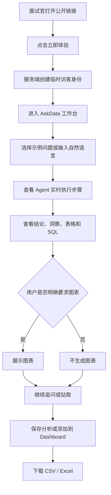
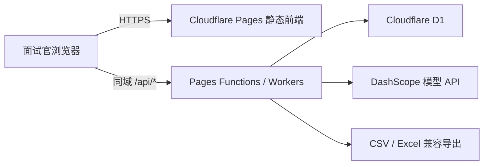

# AskData AI 数据分析 Agent - 一键体验 Demo PRD

## 1. 文档信息

| 项目 | 内容 |
| --- | --- |
| 产品名称 | AskData AI 数据分析 Agent |
| PRD 版本 | v1.1（Cloudflare 方案） |
| 产品形态 | 可公开访问的 Web 应用，Cloudflare 同域全栈部署 |
| 目标场景 | 作品集展示、面试演示、访客自助体验 |
| 当前基础版本 | Agent API v0.9.0 |
| 默认数据源 | Cloudflare D1 内置演示业务库（SQLite 语义） |
| 模型服务 | 阿里云百炼 DashScope OpenAI-compatible API |

## 2. 产品背景

现有 AskData 项目已经具备自然语言转 SQL、SQL 安全校验、只读查询、确定性数据分析、按需图表、会话记忆、结果保存、Dashboard、报表导出、登录鉴权和钻取分析等能力。

当前登录方式需要邮箱和密码，不适合面试官快速体验。项目需要增加“一键体验 Demo”，让访客打开公开链接后无需获取账号密码即可进入工作台，同时保证模型费用、数据隔离和服务安全可控。

线上产品不是单独运行的静态 HTML。静态前端由 Cloudflare Pages 托管，`/api/*` 由 Pages Functions（Workers Runtime）处理，D1 保存演示业务数据和访客分析，最终通过同一个 HTTPS 链接访问。直接双击 HTML 时仍提供独立离线 Mock 体验。

## 3. 产品目标

### 3.1 核心目标

1. 面试官打开链接后，在 10 秒内进入可用的分析工作台。
2. 访客无需注册或输入密码即可完成一次端到端数据分析。
3. 完整展示 Agent 的意图识别、Schema 检索、SQL 生成、校验、执行、分析和回答过程。
4. 图表只在访客明确要求时生成。
5. 访客之间的会话、保存结果和 Dashboard 相互隔离。
6. 模型密钥、数据库文件和内部配置不能暴露给浏览器。
7. 通过限流、访客过期和数据清理控制公开 Demo 的费用与风险。

### 3.2 非目标

- 本阶段不接入企业 SSO、微信登录或第三方 OAuth。
- 本阶段不支持访客上传数据库或修改数据源。
- 本阶段不开放 MySQL 配置、Schema 同步和管理员接口给访客。
- 本阶段不实现团队共享、复杂角色权限、定时报表和消息推送。
- 本阶段不提供无限调用额度。

## 4. 目标用户

### 4.1 访客 / 面试官

希望快速了解产品能力，不愿注册或记忆密码。主要操作为提问、查看结果、钻取分析、生成图表、保存到个人 Dashboard 和下载报表。

### 4.2 项目展示者 / 管理员

负责配置模型 API、连接 GitHub 与 Cloudflare、查看服务状态、控制公开体验额度，并在必要时维护 D1 演示数据。

## 5. 产品定位

AskData 是一个面向业务数据分析的 AI Agent。用户使用自然语言提出问题，系统自动检索相关 Schema、生成只读 SQL、验证并执行查询，再返回可信结论、数据表格、SQL 和可选图表。

核心价值：

- 降低业务查询门槛；
- 展示可解释的 Agent 执行过程；
- 通过 SQL 校验和只读执行降低数据风险；
- 让一次查询结果可以继续追问、钻取、保存和导出。

## 6. 产品范围与状态

| 模块 | 功能 | 优先级 | 状态 |
| --- | --- | --- | --- |
| Agent | 自然语言转 SQL 完整链路 | P0 | 已完成 |
| 安全 | 单语句、只读、表字段白名单、LIMIT、修复循环 | P0 | 已完成 |
| 分析 | 质量检查、统计、趋势、排名、异常洞察 | P0 | 已完成 |
| 图表 | 按用户明确意图生成图表 | P0 | 已完成 |
| Web | HTML/CSS/JavaScript 工作台 | P0 | 已完成 |
| API | FastAPI 本地版、Pages Functions 线上版、SSE 进度 | P0 | 已完成 |
| 会话 | 多轮对话、历史会话和记忆 | P0 | 已完成 |
| 结果 | 保存分析、CSV/Excel 导出 | P0 | 已完成 |
| Dashboard | 个人仪表盘和分析卡片 | P0 | 已完成 |
| 钻取 | 下钻、上卷和父子分析关联 | P0 | 已完成 |
| 鉴权 | 邮箱密码和 HttpOnly Cookie | P0 | 已完成 |
| Demo | 一键访客体验和 Cookie 数据隔离 | P0 | 已完成 |
| Demo | Cookie 数据隔离 + 加盐网络标识总计 2 次提问额度 | P0 | 已完成 |
| Demo | IP 限流、过期和自动清理 | P1 | 待实现 |
| 模型 | 真实 DashScope API 联调 | P0 | 待联调 |
| 部署 | Cloudflare Pages/Functions/D1 配置 | P0 | 代码已完成，待连接账号 |
| 数据源 | 真实 MySQL 只读连接 | P1 | 已具备能力，Demo 暂不启用 |

## 7. 用户体验流程



## 8. 功能需求

### 8.1 一键体验入口

登录页增加主按钮“立即体验 Demo”。

要求：

- 不要求访客填写邮箱或密码；
- 点击后调用 `POST /api/auth/guest`；
- 服务端创建随机访客用户和临时会话；
- 通过 HttpOnly Cookie 写入不透明会话令牌；
- 登录页保留“管理员登录”，用于展示完整鉴权能力；
- 按钮请求期间显示“正在进入体验…”并禁止重复点击；
- 创建失败时展示明确错误和重试按钮。

### 8.2 访客身份与数据隔离

每个浏览器首次点击体验时创建独立访客身份：

```text
user_id: guest_<随机ID>
display_name: Demo Guest
is_guest: true
is_admin: false
```

要求：

- 访客只能读取自己的会话、运行结果、保存分析和 Dashboard；
- 访客不能访问其他用户或管理员数据；
- 访客不能调用数据源测试和 Schema 同步接口；
- 访客不能修改数据库或系统配置；
- 访客退出或会话过期后，不再允许使用原会话令牌。

### 8.3 访客有效期

- 访客登录会话默认有效期：2 小时；
- 访客产生的会话、保存分析和 Dashboard 默认保留：24 小时；
- 服务端定期清理过期访客及其关联数据；
- 管理员正式账号不受访客清理策略影响。

以上时间必须允许通过环境变量调整。

### 8.4 使用额度和限流

默认限制：

- 每个访客最多提交 20 次 Agent 查询；
- 每个 IP 每小时最多创建 10 个访客会话；
- 每个 IP 每小时最多提交 60 次 Agent 查询；
- 同一访客最多同时运行 1 个任务；
- 单次问题最长 1,000 字；
- 查询返回最多 5,000 行，网页最多直接展示前 100 行。

达到限制时：

- 返回 HTTP 429；
- 网页展示“本次体验额度已用完”；
- 已产生的结果仍可查看和下载；
- 不继续调用模型 API。

具体额度必须可通过环境变量调整。

### 8.5 示例问题

工作台首页展示以下示例：

- 最近 30 天销售额趋势如何？
- 各区域订单量排名是什么？
- 销售额最高的前 5 个产品是哪些？
- 本月与上月销售额相比变化多少？
- 找出销售额异常的日期并说明原因。
- 请生成最近 30 天销售额折线图。

点击示例直接发起查询。只有最后一类明确要求图表的问题才生成图表。

### 8.6 Agent 执行过程

前端实时展示：

1. 意图识别；
2. Schema 检索；
3. 分析规划；
4. SQL 生成；
5. SQL 安全校验；
6. SQL 执行；
7. 数据分析；
8. 回答完成。

要求支持任务取消、SSE 断线回放和失败提示，不向访客展示内部 Prompt、模型密钥或完整 Schema。

### 8.7 结果展示

每次分析结果包含：

- 自然语言结论；
- 确定性洞察；
- 数据表格；
- SQL 文本、方言和执行耗时；
- 数据范围和截断提示；
- 可选图表；
- 推荐追问；
- 可用的下钻或上卷操作。

### 8.8 图表策略

- 默认不生成图表；
- 用户明确勾选“生成图表”，或问题包含明确制图要求时才生成；
- 用户只问趋势、排名或对比时，仍可仅返回结论和表格；
- Dashboard 只展示来源分析已有的图表，不额外生成。

### 8.9 多轮对话与钻取

- 当前会话内支持结果解释和继续追问；
- 需要新数据时进入 Text2SQL 链路；
- 只解释已有结果时不重复查询数据库；
- 区域排名支持下钻产品销售额；
- 产品排名支持下钻区域分布；
- 日级趋势支持上卷到月度趋势；
- 子分析记录父运行 ID 和钻取方向。

### 8.10 保存、Dashboard 与下载

访客可在有效期内：

- 保存已完成分析；
- 将保存分析添加到个人 Dashboard；
- 从 Dashboard 查看完整分析；
- 从 Dashboard 移除卡片；
- 下载 CSV；
- 下载包含“分析概览”“数据明细”“SQL”的 Excel 报告。

访客数据到期后自动删除，网页需要显示“Demo 数据仅临时保留 24 小时”。

### 8.11 管理员登录

登录页保留邮箱密码入口。

管理员可以：

- 长期保存个人数据；
- 查看数据源连接状态；
- 测试数据源；
- 同步 Schema；
- 使用未来配置的真实 MySQL 数据源。

访客不能看到或操作管理按钮。

## 9. 页面需求

### 9.1 登录 / Demo 入口页

包含：

- AskData 品牌信息；
- “立即体验 Demo”主按钮；
- “管理员登录”次入口；
- Demo 说明：无需注册、临时数据、体验额度；
- 隐私和费用提示。

### 9.2 工作台

包含：

- 当前访客身份标识“Demo Guest”；
- 剩余查询次数；
- 最近会话；
- 已保存分析；
- 我的仪表盘；
- 数据源状态；
- 问题输入框和图表选择项；
- Agent 执行过程和结果区域；
- Demo 数据过期提示。

### 9.3 额度耗尽状态

包含：

- 额度耗尽说明；
- 仍可查看已有结果；
- 不再允许新建查询；
- 可重新打开项目介绍或联系作者。

## 10. API 需求

### 10.1 新增接口

| 方法 | 路径 | 作用 |
| --- | --- | --- |
| `POST` | `/api/auth/guest` | 创建或恢复当前浏览器的访客体验会话 |
| `GET` | `/api/demo/quota` | 获取访客额度、过期时间和使用状态 |

### 10.2 调整接口

`GET /api/auth/me` 返回增加：

```json
{
  "user": {
    "id": "guest_xxx",
    "display_name": "Demo Guest",
    "is_guest": true,
    "is_admin": false
  },
  "demo": {
    "expires_at": 0,
    "query_limit": 20,
    "query_used": 0,
    "query_remaining": 20
  }
}
```

`POST /api/chat` 和 `POST /api/drilldown` 在执行前检查访客额度；任务成功创建后计入一次使用量。

### 10.3 接口安全

- 所有业务接口从 HttpOnly Cookie 获取身份；
- 浏览器不能提交或伪造 `user_id`；
- 管理接口继续要求 `is_admin=true`；
- API 错误不能返回密码、Cookie、模型密钥、数据库路径或内部 Prompt；
- 所有响应携带请求 ID，便于排查问题。

## 11. 数据设计

现有 `auth_users` 增加：

- `is_guest`；
- `expires_at`；
- `query_limit`；
- `query_used`。

访客数据继续使用现有用户 ID 关联：

- 会话消息；
- 保存分析；
- Dashboard；
- Dashboard 卡片；
- 后台运行记录。

清理任务按照访客 `expires_at` 删除访客账号及关联持久化数据。实现时必须保证正式用户数据不受影响。

## 12. 非功能需求

### 12.1 性能

- 首页静态资源首次加载目标小于 2 秒；
- 创建访客身份目标小于 500 毫秒；
- 不含模型耗时的 API 响应目标小于 500 毫秒；
- Agent 执行过程在任务创建后 1 秒内开始显示；
- 单实例支持至少 4 个并行 Agent 任务。

### 12.2 安全

- 全站 HTTPS；
- Cookie 使用 HttpOnly、Secure、SameSite=Lax；
- SQL 只读校验必须开启；
- API Key 只存在 Cloudflare Secret 或本机 `.dev.vars`；
- `.env`、`.dev.vars` 不进入代码仓库；
- 访客无管理员权限；
- 对访客输入长度、频率和并发进行限制；
- 数据库演示文件不可通过静态路径下载。

### 12.3 可用性

- `/api/health` 提供健康检查；
- 模型 API 不可用时返回明确提示，不输出伪造分析；
- Demo 标准问题可配置离线规则兜底；
- D1 持久化业务数据、任务、保存分析和 Dashboard；
- 前端支持桌面和移动端基础响应式布局。

### 12.4 成本控制

- 访客限额在调用模型前检查；
- 模型请求设置超时；
- 不允许访客并发提交多个任务；
- 可通过环境变量临时关闭访客入口；
- 可配置使用成本较低的模型用于公开 Demo。

## 13. 部署架构



推荐采用 Pages 全栈部署：

- Pages 托管 `web/` 静态资源；
- Pages Functions 执行 Worker API 和 SSE；
- `_routes.json` 保证只有 `/api/*` 消耗 Workers 请求额度；
- D1 持久化演示业务数据和访客结果；
- 模型 Key 使用 Cloudflare Secret；
- 前后端同域，不需要 CORS，Cloudflare 自动提供 HTTPS；
- GitHub 每次推送自动构建和发布。

## 14. 环境变量

新增建议：

```text
ASKDATA_GUEST_QUERY_LIMIT=2
DASHSCOPE_BASE_URL=https://dashscope.aliyuncs.com/compatible-mode/v1
DASHSCOPE_MODEL=qwen-plus
```

现有关键配置：

```text
DASHSCOPE_API_KEY
DASHSCOPE_MODEL
DASHSCOPE_BASE_URL
```

## 15. 验收标准

### 15.1 一键进入

- 未登录用户打开链接能看到“立即体验 Demo”；
- 点击后无需账号密码进入工作台；
- 刷新页面后，在有效期内仍保持访客登录；
- 退出后会话令牌失效。

### 15.2 功能体验

- 标准问题可以完成端到端分析；
- 页面实时显示 Agent 执行步骤；
- 结果包含结论、表格和 SQL；
- 普通问题不生成图表；
- 明确要求折线图时生成图表；
- 可以执行至少一次下钻或上卷；
- 可以保存结果、添加到 Dashboard 和下载 Excel。

### 15.3 隔离与权限

- 两个访客不能互相读取会话、分析和 Dashboard；
- 访客调用数据源同步接口返回 403；
- 访客不能访问管理员功能；
- 到期访客不能继续提交查询；
- 清理过程不删除正式用户数据。

### 15.4 限额

- 达到个人查询额度后，新查询返回 429；
- 达到 IP 频率限制后，创建访客或提交查询返回 429；
- 被拒绝的请求不调用模型 API；
- 页面能展示剩余次数和到期时间。

### 15.5 部署

- 公网 HTTPS 链接可以访问；
- `/api/health` 返回正常，并确认 D1 和模型配置状态；
- API Key 不出现在网页源代码和 API 响应中；
- Cloudflare 重新部署后 D1 数据保持不变；
- Chrome、Safari 和 Edge 最新稳定版本可完成核心流程。

## 16. 成功指标

- 访客进入工作台成功率大于 98%；
- 首次成功分析完成率大于 90%；
- 从打开链接到提交首个问题的中位时间小于 30 秒；
- Demo 会话中至少 50% 使用一次追问、钻取或图表；
- 公开体验期间无跨用户数据泄露；
- 单访客模型费用不超过设定预算。

## 17. 里程碑

### M1 - 一键体验开发

- 访客用户和会话模型；
- `POST /api/auth/guest`；
- 登录页“立即体验 Demo”；
- 访客标识和到期提示；
- 用户级限额。

### M2 - 安全与清理

- IP 频率限制；
- 单访客并发限制；
- 访客数据过期清理；
- 管理接口隔离；
- 安全测试和回归测试。

### M3 - 真实模型 API

- DashScope 模型配置；
- API 连接检测；
- 通用自然语言问题验收；
- 超时、错误和费用保护。

### M4 - Cloudflare 上线

- GitHub 仓库连接 Cloudflare Pages；
- 自动创建或绑定 D1；
- 配置 `DASHSCOPE_API_KEY` Secret；
- 验证自动构建、HTTPS 和 `pages.dev` 链接；
- 可选绑定自定义域名；
- 完成公网验收并交付面试链接。

## 18. 风险与应对

| 风险 | 应对措施 |
| --- | --- |
| 公开链接被滥用导致模型费用上升 | 用户/IP 限流、并发限制、总开关、低成本模型 |
| 访客共享账号导致数据混乱 | 每个浏览器创建独立 Cookie 访客身份，不使用公共共享账号 |
| 清除 Cookie 绕过额度 | 使用加盐 HMAC 网络标识计数，不保存原始 IP；同一出口网络共享额度 |
| API Key 暴露 | 只保存在 Cloudflare Secret，所有模型请求由 Function 发起 |
| Prompt 或数据内容影响 SQL 安全 | SQL AST 校验、表字段白名单、只读执行器、LIMIT |
| 访客历史数据持续膨胀 | 24 小时过期和定期清理 |
| 模型服务不可用 | 超时、清晰错误、标准问题离线兜底、健康监控 |
| D1 免费额度耗尽 | 静态路由绕过 Function、每访客总计 2 次额度、用量告警 |

## 19. 最终交付物

- 可公开访问的 HTTPS 链接；
- 一键访客体验入口；
- 本地 FastAPI 版管理员登录入口；
- Cloudflare D1 内置演示数据；
- 真实模型 API 配置；
- Cloudflare Pages/Functions/D1 部署配置（同时保留 Docker 本地方案）；
- 环境变量模板；
- 自动化测试；
- README 部署与面试演示说明。
